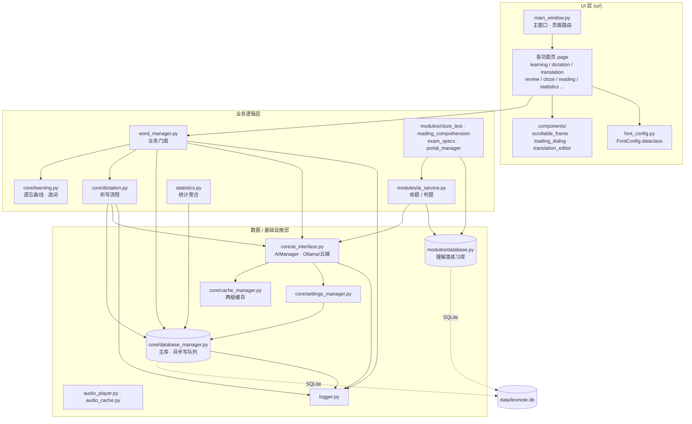
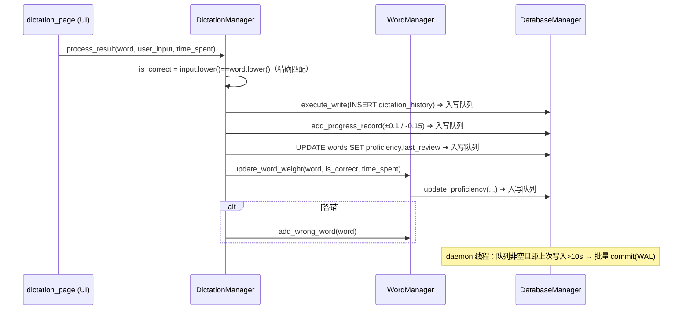

# LexiNote

> 基于权重算法与 AI 辅助的桌面英语学习工具 · tkinter GUI + SQLite(WAL) + 本地/云端 LLM
>
> 版本 **v2.7.4** · Python 3.12+ · MIT License

LexiNote 是一款单机英语学习客户端，围绕「以遗忘曲线驱动的自适应复习」构建，集成单词学习、听写、翻译、复习、完形填空、阅读理解等模块，并通过 Ollama / 云端 OpenAI 兼容接口提供智能判题与内容生成。本文档以**技术架构**为主线，功能操作细节见 [`SETTINGS.md`](docs/SETTINGS.md) 与 [`DEVELOPER_DOCS.md`](docs/DEVELOPER_DOCS.md)。

---

## 目录

- [技术栈](#技术栈)
- [架构总览](#架构总览)
- [分层与目录结构](#分层与目录结构)
- [核心设计](#核心设计)
  - [单例与生命周期](#单例与生命周期)
  - [数据访问层与异步写队列](#数据访问层与异步写队列)
  - [AI 编排与降级](#ai-编排与降级)
  - [多级缓存](#多级缓存)
  - [学习算法](#学习算法)
  - [UI 架构](#ui-架构)
- [数据模型](#数据模型)
- [关键数据流：听写提交](#关键数据流听写提交)
- [快速开始](#快速开始)
- [质量保障](#质量保障)
- [已知架构债务](#已知架构债务)
- [许可证](#许可证)

---

## 技术栈

| 领域 | 选型 | 说明 |
| --- | --- | --- |
| 语言 | Python 3.12+ | 类型注解 + `dataclass` |
| GUI | tkinter | 标准库，无外部 UI 依赖 |
| 持久化 | SQLite (WAL) | 单文件 `data/lexinote.db`，`busy_timeout=5000ms` |
| AI | Ollama / OpenAI 兼容云端 | `requests` 直连，`ThreadPoolExecutor` + `asyncio` 并发 |
| 语音 | edge-tts + playsound | 微软 Edge 神经语音合成（免费、无需 API key、国内可达）+ 本地缓存播放 |
| 静态检查 | mypy + flake8 | pre-commit 门禁挂 mypy |
| 测试 | pytest | 会话级 `tk_root` fixture 支持 headless |

依赖清单见 [`requirements.txt`](requirements.txt)（运行期仅 `edge-tts` / `playsound` / `requests`，其余为开发工具）。

---

## 架构总览

三层结构，依赖自上而下（UI → 业务逻辑 → 数据/基础设施），`logger` 为全局叶子节点。



**关键约定**

- `word_manager.py` 是事实上的**业务门面**（非单例），UI 与各练习模块通过它访问共享状态；它在构造时持有 `DatabaseManager()` 单例。
- 数据访问层暴露 `execute_read` / `execute_write` 统一入口，屏蔽连接管理与线程安全细节。
- 存在少量分层泄漏（部分 UI 页直接引用 `core` 类、理解类页面接收整个 `MainWindow` 实例），详见[已知架构债务](#已知架构债务)。

---

## 分层与目录结构

```
25-10-25/
├── main.py                     # 入口：创建 Tk root → MainWindow → mainloop
├── logger.py                   # 全局日志（模块级单例 + log_info/warning/error 兼容函数）
│
├── ui/                         # ── UI 层 ──
│   ├── main_window.py          #   主窗口、侧边导航、页面懒加载与切换（pack_forget 复用实例）
│   ├── font_config.py          #   FontConfig dataclass（字典式访问 + 缺键兜底）
│   ├── *_page.py               #   10 个功能页（learning/dictation/translation/review/
│   │                           #     word_set/settings/statistics/cloze_test/
│   │                           #     reading_comprehension/ai_assistant）
│   └── components/             #   复用组件：scrollable_frame / loading_dialog / translation_editor
│
├── word_manager.py             # ── 业务门面 ── 词库 CRUD、权重/熟练度更新、错词、选词
├── statistics.py               #   统计聚合
├── core/                       # ── 核心业务 + 数据/基础设施 ──
│   ├── learning.py             #   ForgettingCurve 遗忘曲线权重、WordSelector 加权选词
│   ├── dictation.py            #   DictationManager 听写会话/评分/落库
│   ├── ai_interface.py         #   AIManager：Ollama/云端调用、请求合并、缓存、降级
│   ├── database_manager.py     #   主库单例：WAL、异步写队列、JSON→SQLite 迁移
│   ├── settings_manager.py     #   设置单例（存 settings 表，实时生效）
│   ├── cache_manager.py        #   两级缓存（内存 + 文件），TTL/自动清理
│   └── text_formatter.py       #   文本格式化
│
├── modules/                    # ── 理解类练习 + AI 服务 ──
│   ├── ai_service.py           #   AIService：命题/判题编排（组合 AIManager + ComprehensionDatabase）
│   ├── database.py             #   ComprehensionDatabase 单例：cloze/reading/delete_logs 表
│   ├── cloze_test.py           #   完形填空业务
│   ├── reading_comprehension.py#   阅读理解业务
│   ├── exam_specs.py           #   命题提示词规格（build_*_prompt）
│   ├── portal_manager.py       #   离线题库门户
│   └── word_importer.py        #   JSON 批量导入
│
├── audio_player.py             # 发音播放（edge-tts 神经语音合成 + 本地缓存播放）
├── audio_cache.py              # 音频兜底缓存（md5 键、LRU 近似、30 天 TTL、500MB 上限）
│
├── data/                       # SQLite 数据库 + 遗留 JSON + 运行日志
├── cache/                      # ai_text/ (文本响应) · ai_tts/ (语音) · audio/ (兜底)
├── tests/                      # pytest 用例 + conftest.py
├── mypy.ini / .pre-commit-config.yaml / .flake8   # 质量门禁配置
└── requirements.txt
```

---

## 核心设计

### 单例与生命周期

核心管理器采用统一单例模式：`__new__` 返回类级 `_instance` + `threading.Lock`，`__init__` 内以 `_initialized` 守卫防止重复初始化。

| 类 | 位置 | 单例方式 |
| --- | --- | --- |
| `DatabaseManager` | `core/database_manager.py` | `__new__` + `_lock` + `_initialized` |
| `SettingsManager` | `core/settings_manager.py` | 同上，构造内注入 `DatabaseManager()` |
| `CacheManager` | `core/cache_manager.py` | `__new__` 单例 + `get_cache_manager()` 工厂 |
| `AIManager` | `core/ai_interface.py` | `__new__`（无锁，靠 `_initialized` 守卫） |
| `ComprehensionDatabase` | `modules/database.py` | `__new__` 单例 |
| `Logger` | `logger.py` | 模块级 `global_logger` 实例 |

> `WordManager` **不是**单例，由 `MainWindow` 直接实例化并向下注入，作为业务门面。

### 数据访问层与异步写队列

`DatabaseManager` 是主库唯一入口，核心机制：

- **WAL 模式** + `busy_timeout=5000ms`，缓解读写锁争用。
- **异步写队列**：`execute_write(query, params, immediate=False)` 默认将写操作入 `_write_queue`，由 daemon 线程批量落盘（队列非空且距上次写入 > 10s 触发）；`immediate=True` 时同步提交并返回 `lastrowid`。
- **读写隔离**：`execute_read` 每次新建连接（`row_factory=sqlite3.Row`），与写线程互不阻塞。
- **批量导入**：`execute_write_many` 供词库导入使用。
- **迁移**：`_import_from_json` 在词库为空时一次性把旧版 `word_dict.json` 灌入 `words` 表。

理解类练习数据由 `ComprehensionDatabase`（`modules/database.py`）独立管理，与主库共用同一 `lexinote.db` 文件但负责不同的表。

### AI 编排与降级

`AIManager`（`core/ai_interface.py`）是 AI 编排核心：

- **多后端**：`ai_mode ∈ {off, local, cloud}`。`local` 走 Ollama `POST /api/generate`（健康检查 `/api/tags`）；`cloud` 走 OpenAI 兼容 `POST {cloud_api_url}`（`Bearer` 鉴权）；`off` 直接返回哨兵字符串，不做任何网络探测。
- **并发控制**：`ThreadPoolExecutor(max_workers=2)` + `asyncio.Semaphore(2)`；`_safe_post` 对网络异常做指数退避重试。
- **请求合并**：相同 `hash(prompt)` 的并发请求复用同一 future，避免重复调用。
- **响应缓存**：成功结果写入 `ai_cache` 表（`prompt_hash` 唯一），后续同问先查缓存。
- **降级链**：AI 不可用时，`translate/example/get_word_details/advise` 回退到本地词典与规则化建议；`evaluate` 解析失败时回退精确匹配。

`AIService`（`modules/ai_service.py`）在其上做命题/判题：`exam_specs.build_*_prompt` 构造提示词 → 调用 `AIManager` → 鲁棒 JSON 解析（剥离代码围栏、纠正常见字段拼写）→ 落库。

### 多级缓存

- **`CacheManager`（两级）**：内存层（约 500 项上限，按最近访问保留）+ 文件层（`cache/ai_text/*.json` 文本响应、`cache/ai_tts/*.mp3` 语音，默认 TTL 30 天）；写入采用 `os.replace` 原子替换；daemon 线程每 24h 清理过期文件。
- **`AudioCache`（兜底）**：md5(`text_lang`) 为键，`cache_index.json` 索引，30 天 TTL、500MB 上限、`last_access` 最旧优先淘汰；仅在全局 `CacheManager` 不可用时由 `AudioPlayer` 回退启用。

### 学习算法

**遗忘曲线权重**（`core/learning.py` · `ForgettingCurve`）：

```
weight = base_weight * (1 - mastery_score * mastery_factor) * (1 + interval_days * forget_rate)
       # base_weight=1.0, mastery_factor=0.8, forget_rate=0.02
       # clamp 到 [0.1, 5.0]；无复习记录直接返回上限 5.0
```

- 掌握度更新 `update_mastery_score`：正确 `+0.15`、错误 `−0.1`，钳制 `[0, 1]`。
- 选词 `WordSelector.select_words`：以 `weight = 1.0 − mastery_score` 用 `random.choices` 加权采样。

**熟练度更新**（`word_manager.py`）：`update_word_weight` 引入**响应时间分档**——答对时越快加分越多（`<2s` +0.15，`>10s` +0.05）、答错时越快扣分越多；结果钳制 `[0, 1]` 后写回 `proficiency`。

### UI 架构

- **启动链**：`main.py` → `MainWindow.__init__`（建 `settings_manager` / `audio_player` / `word_manager`）→ `mainloop`。
- **页面路由**：页面**懒加载**进 `self._pages` 字典，切换用 `pack_forget()` 而非 `destroy()` 以**复用实例**并保留状态；部分页暴露 `on_show` / `on_enter` 钩子做延迟刷新。
- **通用构造签名**：多数页面为 `(parent, word_manager, settings_manager, font_config)`，共享同一批注入的管理器。
- **`FontConfig`**（`ui/font_config.py`）：dataclass，实现 `__getitem__` / `get` / `__contains__` 使其可字典式访问，所有字体键带默认值，缺键返回兜底元组，从根源杜绝 `KeyError`。
- **复用组件**：`create_scrollable_frame`（Canvas + Scrollbar + 滚轮绑定）、`LoadingDialog`（AI 异步生成时的模态进度框）、`TranslationEditor`。

---

## 数据模型

单文件 `data/lexinote.db`（WAL），两个访问单例分管不同表：

**主库（`DatabaseManager`）**

| 表 | 用途 |
| --- | --- |
| `word_sets` | 多词库元信息 |
| `words` | 单词及 `proficiency` / `familiarity` / `last_review` 等学习字段 |
| `progress` | 每次练习的进度流水 |
| `settings` | 应用设置（键值） |
| `ai_cache` | AI 响应缓存（`prompt_hash` 唯一） |
| `dictation_history` | 听写历史 |
| `exercise_sessions` | 练习会话汇总 |

**理解类练习库（`ComprehensionDatabase`）**

| 表 | 用途 |
| --- | --- |
| `cloze_tests` | 完形填空题目 |
| `reading_comprehensions` | 阅读理解题目 |
| `delete_logs` | 删除审计 |

---

## 关键数据流：听写提交

以「用户在听写页提交一个单词」为例，串起 UI → 业务 → 数据的完整链路：



常规提交走**精确匹配 + 延迟写队列**；AI 语义评判仅在 `summarize` 汇总路径触发，不阻塞主提交流程。

---

## 快速开始

**环境**：Python 3.12+；如需 AI 功能，本地运行 Ollama（默认端口 `11434`）或配置云端 API；语音合成需联网。

```bash
# 1. 安装依赖
pip install -r requirements.txt

# 2.（可选）准备 Ollama 模型
ollama pull gemma:7b        # 或其他 chat 模型

# 3. 运行
python main.py
```

首次启动会自动建库；如检测到旧版 `word_dict.json` 且词库为空，会一次性迁移到 SQLite。

---

## 质量保障

- **测试**：`tests/` 下以 pytest 组织；`conftest.py` 提供会话级 `tk_root` fixture（headless tkinter）与 autouse 的单例重置，保证用例隔离。核心层（`word_manager` / `core/dictation`）已补齐关键路径覆盖。
- **静态检查**：`mypy.ini` 限定检查范围 `files = core, modules, word_manager.py`（`explicit_package_bases`、`ignore_missing_imports`）；已清零该范围内的类型错误。
- **门禁**：`.pre-commit-config.yaml` 挂载 mypy hook（`pass_filenames: false`，依赖 `mypy.ini` 的 `files`），提交时自动执行。
- **代码风格**：`.flake8`（`max-line-length=88`，忽略 `E402/W503`），手动运行。
- **异常分层原则**：关键路径（数据写入、状态变更、初始化）的失败升级为 `log_error/log_warning` 使其可见；容错路径（网络降级、缓存 miss、格式解析回退）保持静默，避免日志噪声。

运行测试：

```bash
pytest tests/ -q
mypy            # 读取 mypy.ini
```

---

## 已知架构债务

以下为已识别、尚待清理的技术债，供二次开发参考：

1. **双存储并存**：SQLite 为主，但仍有遗留 JSON（`word_dict.json` / `word_progress.json` 等）被部分模块读取，处于迁移过渡态。
2. **孤儿文件**：`data/database.db`（0 字节早期版本遗留）已清理；`cache/ai_tts`（CacheManager 主 TTS 缓存）与 `cache/audio`（AudioCache 兜底缓存）为主／兜底分层关系，并非冗余，二者统一可列为后续优化项。
3. **分层泄漏**：部分 UI 页面直接引用 `core` 类；`cloze_test_page` / `reading_comprehension_page` / `ai_assistant_page` 接收整个 `MainWindow` 实例以取共享管理器。
4. **门禁覆盖不全**：mypy 仅检查 `core / modules / word_manager.py`，`ui/` 与 `main.py` 未纳入类型检查；flake8 未接入 pre-commit。
5. **`AIManager.__new__` 未加锁**：仅靠 `_initialized` 守卫，理论上存在极小初始化竞态。

---

## 许可证

MIT License · 版本历史见 [`CHANGELOG.md`](docs/CHANGELOG.md)
